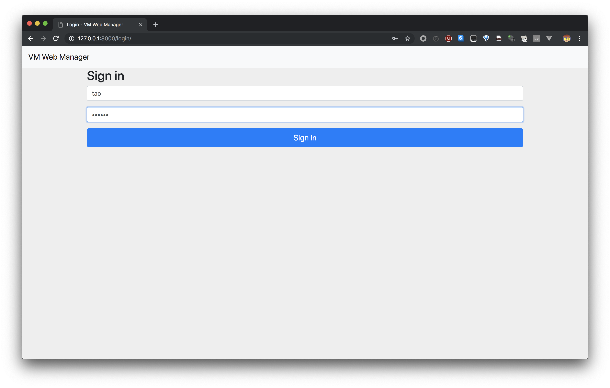
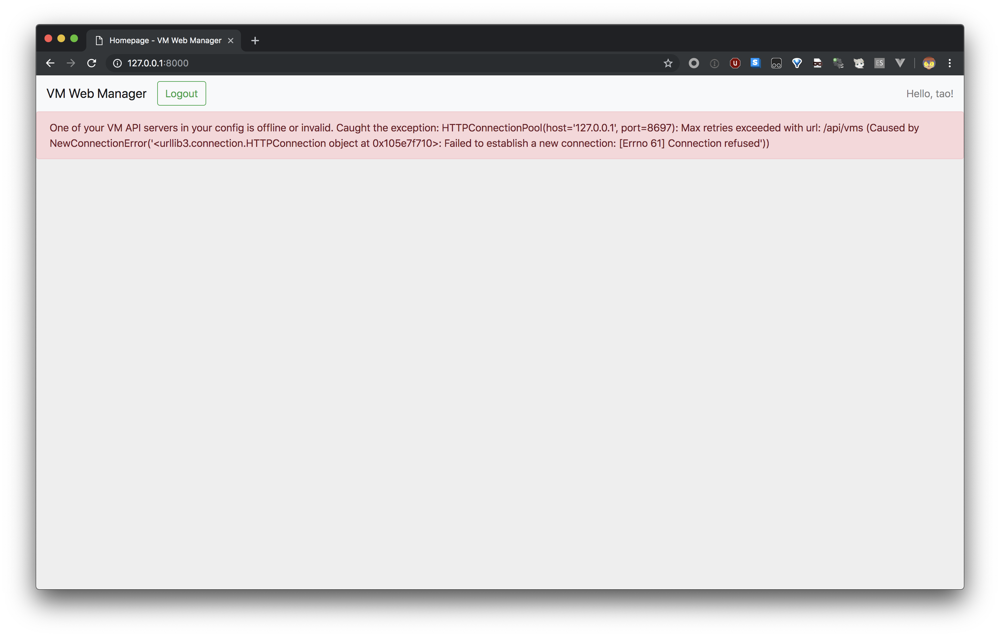
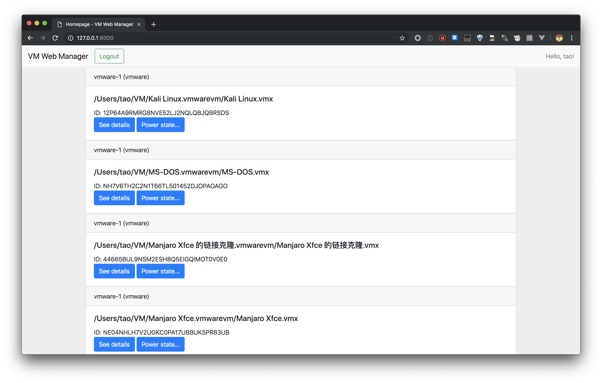
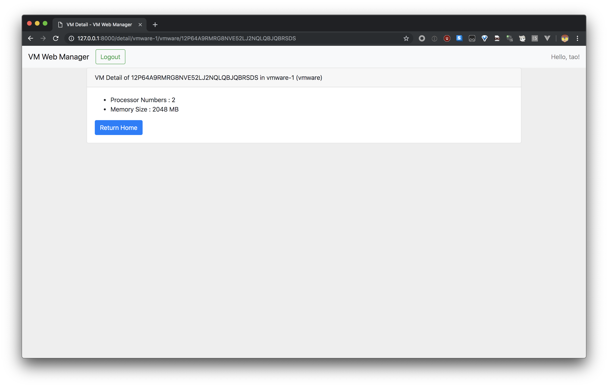
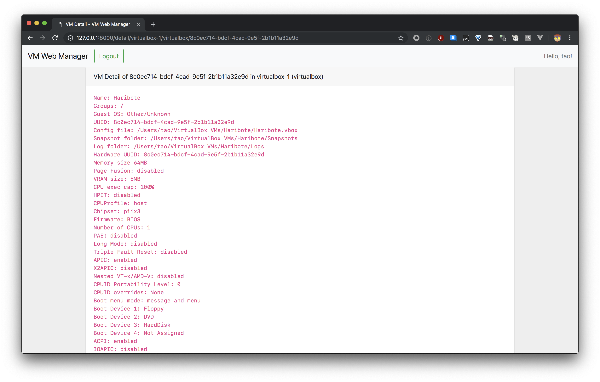
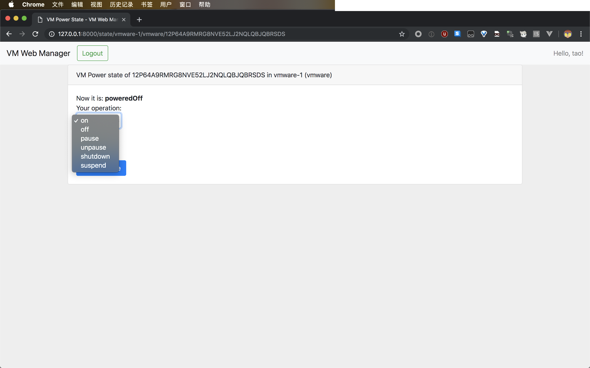
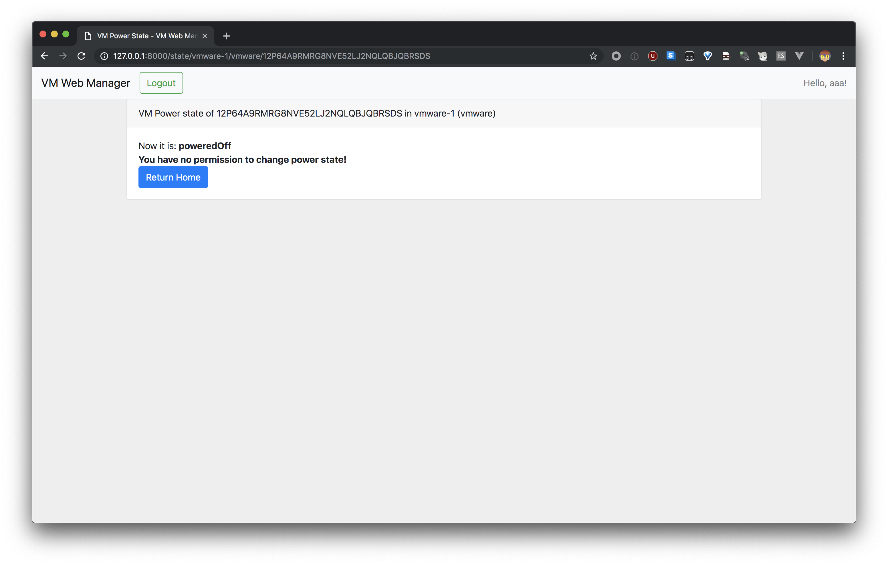

# VM Web Manager

(Python & Deep Learning 101, USTC, 2019 Spring)

Keyu Tao, PB17111630

*Updated in the early morning of March 23, 2019.*

---

## 简介

本项目可用于远程的虚拟机（Virtual Machine）简单管理，支持 VMware（使用官方的 RESTful API）与 VirtualBox（使用 `vboxmanage-rest-api` from <https://github.com/papnkukn/vboxmanage-rest-api>）。包含以下特性：

- 支持配置文件，可以整合**不同来源**的、基于 HTTP 协议的虚拟机管理 API。
- 基于 Django 用户组，允许多种类型的用户：仅查看、查看并改变虚拟机电源状态、管理（使用 Django Admin 面板）。权限划分比原始的 API 更加细化。

用户可以：

- 查看虚拟机列表。
- 查看某个虚拟机的配置信息。
- 查看某个虚拟机的电源状态。
- 改变某个虚拟机的电源状态。

适用于此类的情景：例如，用户需要在外网对内网（如实验室）中的虚拟机进行简单的电源管理操作，但是出于安全性等原因，无法将虚拟机提供的 RESTful API 直接暴露的情况。

在 Python 3.7，macOS 10.14.3，VMware Fusion 11.0.2，VirtualBox 6.0.4 下测试通过。

GitHub 不适合放置较大的二进制文件（不使用 LFS 的情况下），所以要求的小视频发布在了 <https://www.bilibili.com/video/av46592034/>。

## 使用说明

### 初始化

#### VMware

需要手动启用 VMware Workstation 或 VMware Fusion 的 RESTful API 特性，详情可查看 [How does REST API work in VMware Fusion and VMware Workstation?](https://www.starwindsoftware.com/blog/how-does-rest-api-work-in-vmware-fusion-and-vmware-workstation)。

注意：官方提示在目前，使用 VMware RESTful API 时同时使用 VMware 的 UI 界面可能会导致意料之外（unexpected）的结果。（在小视频中表现为 UI 没有及时更新为最新状态）

#### VirtualBox

需要使用 `npm` 下载 `vboxmanage-rest-api`。之后，在终端中执行以下命令以启动 RESTful API 服务器：

```
vboxmanage-rest-api --port 8269 --verbose --vboxmanage /usr/local/bin/vboxmanage
```

其中 `--vboxmanage` 后接 `vboxmanage` 所在位置。**请注意：`vboxmanage-rest-api` 不支持密码验证，不要将此 API 暴露于公网中。**

#### 项目配置

在虚拟环境中安装 `requirements.txt` 中的依赖（`pip install -r requirements.txt`），然后运行 `setup.py`，设置超级用户的用户名与密码（邮箱可以随便填）。

之后打开 `vmapp/config.ini`，根据您的设置，调整 API 的 URL 与用户名、密码（如果有）。最后执行 `python manage.py runserver`，启动服务器。

在浏览器中访问 `http://IP:Port/admin`（IP 与端口根据实际情况修改），使用超级用户登录后可以使用 Django Admin 面板，可以新建用户。对于非 staff 和 superuser 用户，需要加入 `change_power_operation` 用户组以授予改变虚拟机电源状态的权限。

### 使用/功能介绍

在启动对应的虚拟机 API 程序后，启动此项目，登录你的用户。



如果服务器无法连接到配置文件中指定的服务器，会出现错误如下。



如果连接正常，显示如下：



对 VMware 下某台虚拟机点击「See details」，会给出其 CPU 核心数和内存大小。（这是为数不多可以从 VMware RESTful API 获取的东西）



而对 VirtualBox 下某台虚拟机的话，则会显示出大量可以获取到的信息。



对于有权限修改电源状态的用户，可以查看并调整虚拟机的电源状态。



对 VMware 虚拟机，支持以下选项：

- `on`: 启动（已关机或已休眠）的虚拟机。
- `off`: 强制关闭虚拟机。
- `pause`: 暂停虚拟机（此功能与休眠不同，状态未保存到宿主机硬盘）。
- `unpause`: 取消暂停虚拟机。
- `shutdown`: 对于支持的操作系统，使用「友好」的方式关闭，否则与 `off` 相同。
- `suspend`: 休眠虚拟机。

而对 VirtualBox 虚拟机，支持以下选项：

- `on`: 启动已关机的虚拟机。
- `off`: 强制关闭虚拟机。
- `pause`: 休眠虚拟机（VMware 与 VirtualBox 对于相同操作的术语表示不同）。
- `unpause`: 恢复（resume）休眠中的虚拟机。
- `shutdown`: 使用 ACPI 的方式按下电源键，在多数现代操作系统中，这允许操作系统处理关机事务；在不支持的操作系统中，该操作没有效果。

对于无权限调整虚拟机电源状态的用户（不是 superuser、不是 staff，且不在 `change_power_operation` 用户组中），该界面不允许调整虚拟机状态。



点击 Logout，可以登出此用户。

## 代码

主要部分在 Django App `vmapp` 下。

#### Django App `vmapp`

没有定义 Django model，因为虚拟机信息是实时访问 API 调取的，这里没有必要持久化到数据库中。主要代码在：

- `utils.py`：定义几个助手函数，以便 `views.py` 调用。
- `vmman.py`：定义了配置类（含配置文件校验）、虚拟机接口以及从虚拟机接口继承的两个类 `VirtualBox` 和 `VMware`，这两个类中对不同类型的虚拟机进行了处理，使用 `requests` 库实际访问 API 的代码即在类中。
- `views.py`：Django 的 MTV 架构中的 V 部分。处理用户的网络请求，并且返回相应的内容。

网页设计部分的 Django 模版、CSS 等文件放置于 `vmapp` 下的 `templates` 与 `static` 文件夹下，使用到了 Bootstrap 框架。由于这部分非常简单，而且不属于 Python 代码，此处略去详细介绍。

下面根据要求，给出 Python 代码的实现细节。

##### [`vmman.py`](https://github.com/taoky/vm-webman/blob/master/vmapp/vmman.py)

1. 配置文件类 `Config`：使用了 `configparser` 解析配置文件 `config.ini`。在读取文件，理为字典后，对一些必须的值进行了校验。

   *（为了减短报告的长度，代码部分可自行翻阅此文件，不在报告中另行贴出。下同。）*

2. 接口类 `VMManInterface`：借鉴了面向对象中的接口，要求继承此类的类实现 `get_all_vm(self)`, `get_one_vm_info(self, id)`, `get_one_vm_power(self, id)` 和 `update_one_vm_power(self, id, operation)` 这四个函数，否则在调用时会抛出 `NotImplemented` 异常。

3. 类 `VMware` 和 `VirtualBox`：继承了 `VMManInterface`，接受初始化的参数，实现了上述四个函数。这里是实际使用 `requests` 请求 RESTful API 的部分。

4. 类 `VM`：类似结构体，存储虚拟机的 `id`（即虚拟机程序表示虚拟机的唯一编码）、`name`（名字，VMware 为文件名，VirtualBox 为用户为虚拟机起的名字）、`type`（是 VMware 的虚拟机，还是 VirtualBox 的虚拟机）、`section`（属于配置文件中哪一段的虚拟机）。

##### [`utils.py`](https://github.com/taoky/vm-webman/blob/master/vmapp/utils.py)

这里放置着会直接被 `views.py` 调用的一些辅助函数。

1. `get_all_vm_list()`：根据配置 `config`，遍历出所有的虚拟机信息。根据配置文件中 `type` 的不同，读取不同的配置信息，构造不同的类，并分别使用 `get_all_vm()` 获取虚拟机列表。
2. `get_one_vm_detail(id, type, section)` ：根据配置 `config` 与虚拟机的类型与所在 `section`，读取某个虚拟机的信息。方式同上。
3. `get_one_vm_state(id, type, section)`：根据配置 `config` 与虚拟机的类型与所在 `section`，读取某个虚拟机的电源情况。细节同上。
4. `update_one_vm_state(id, type, section, operation)`：根据配置 `config` 与虚拟机的类型与所在 `section`，更改某个虚拟机的电源情况。细节同上。注意用户校验不在此处，而在 `views.py` 中检查用户的 request。
5. `can_change_power_permission(user)`：参数为 Django 用户类型，判断是否可以改变电源情况。判断的参照上文已经写出。

##### [`views.py`](https://github.com/taoky/vm-webman/blob/master/vmapp/views.py)

这里是 Django 中非常重要的文件，直接处理用户的网络请求。所有处理用户请求的函数，都至少需要 `request` 参数。

1. `login(request)`：处理用户登录。如果是 `GET` 请求，给出登录页面；如果是 `POST`，则读取 `POST` 中的用户名与密码，检验正确性，如果正确则实际登录，重定向到 `/`（即 index），否则使用 Django messages 机制返回错误信息。
2. `index(request)`：包含了 `@login_required` 装饰器，用于在用户未登录时定向到登录页面。会读取所有的虚拟机列表，包含 API 服务器无法连接时的错误处理。
3. `logout(request)`：使用了 `@require_POST` 以限制只允许 `POST` 请求。将当前用户登出。
4. `detail(request, section, vm_id, vm_type)`：根据参数访问虚拟机详细信息并使用模版返回。
5. `state(request, section, vm_id, vm_type)`：如果是 `GET` 请求，给出虚拟机电源状态页面，根据用户权限判断是否显示修改的 form；如果是 `POST`，就先判断权限（防止有未授权用户直接修改），再检查新的状态是否在已知几种之内，如果都符合，就向 API 服务器发出请求修改，结果以 messages 机制返回。最后重定向到主页。

##### 杂项

该文件夹中 `__init__.py` 不是一个空文件，里面包含了参数 `config`，用于在该 App 被调用时读取配置信息，并存储在该参数中。

`urls.py` 定义了 URL 与 Views 的对应关系，`urlpatterns` 如下所示：

```python
urlpatterns = [
    path('', views.index),
    path('login/', views.login),
    path('logout/', views.logout),
    path('detail/<str:section>/<str:vm_type>/<str:vm_id>', views.detail),
    path('state/<str:section>/<str:vm_type>/<str:vm_id>', views.state)
]
```

剩余的文件基本都为 Django 自动生成的。

#### 其它

1. 在项目配置 `vmwebman/settings.py` 中添加了 `LOGIN_URL = '/login/'` 以配置 `@login_required` 跳转。

2. `setup.py` 的模块调用顺序比较奇怪，这是因为无法在 `django.setup()` 之前 `from django.contrib.auth.models import Group`。

## 总结

这个项目就当 Django 练手了……毕竟再过几个月就要用到了。个人感觉是：如果 Django 提供 API 给网页前端，让前端访问 Django 项目的 API 来访问这些虚拟机软件的 RESTful API，而不是在 Django 里面访问完了再生成模版扔给用户的话，可以减少不少延时，提高用户体验，只不过自己不太熟 Ajax 之类的东西，而且最近实验不少，就用了最省力的方式。

另外的话之前试过在读取主页的时候就一个一个虚拟机读电源状态，但是最后发现很慢而作罢。可能可以用协程吧，不过协程的部分感觉 Python 3 好几个大版本都有点差别，最后就没去试。

至于坑吧，肯定有，比如说这个版本 VirtualBox 的 `vboxmanage` 在返回虚拟机详细信息的时候无法被 `vboxmanage-rest-api` 完全正确解析（漏了内存），最后发现 shell 输出那里内存一行缺了一个冒号 `:`（别的行都是 `xxx: yyy`，只有内存那里是 `Memory Size xxxMB`，不知道这帮人怎么想的……），于是最后就干脆一股脑输出出来了。

另外因为没有用 models 嘛，Django 内置的针对每个 model 的 permissions 就没法被利用起来了。最后还是靠用户组 + 自己的代码解决权限问题的。

用 Django 搞开发，如果都用它那一套体系是相当方便的，但要搞点不太符合「那一套」的东西的话就要稍微费点劲了。而 Flask 比较小而灵活，搭小项目比较适合，但是对于没有太多经验的人来说，最后的 `app.py` 可能就是一锅大杂烩（体验过改某位同学在学校某台服务器上写的 Flask 项目代码，大片代码重复，所有东西都在同一的文件里，关键是本地环境还搭不起来，简直让人没有看下去的欲望）……

---

OK，~~在评分标准要求下，被迫~~又熬了一天夜，大概加了两千多个字，应该够了吧。